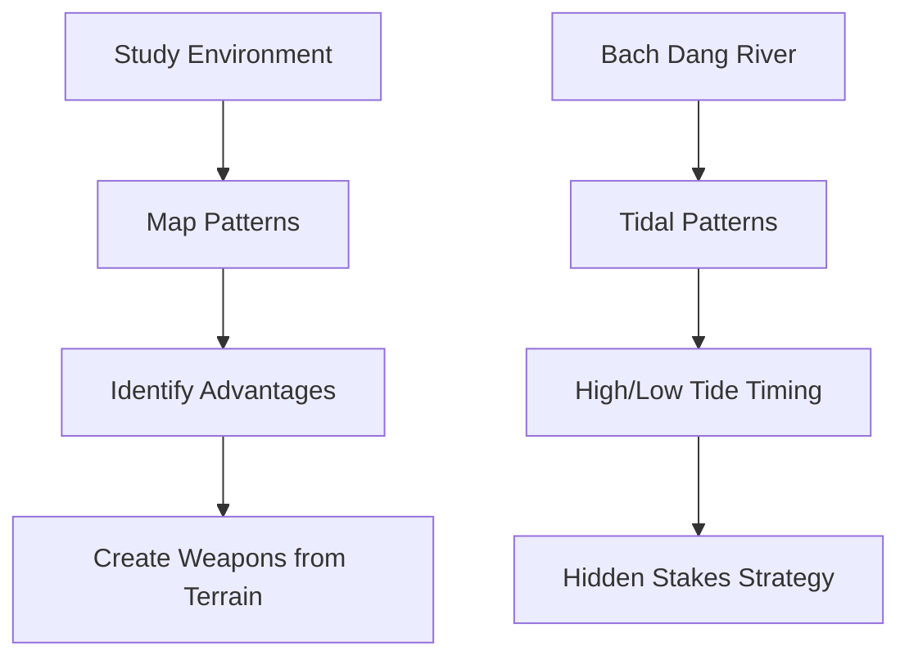
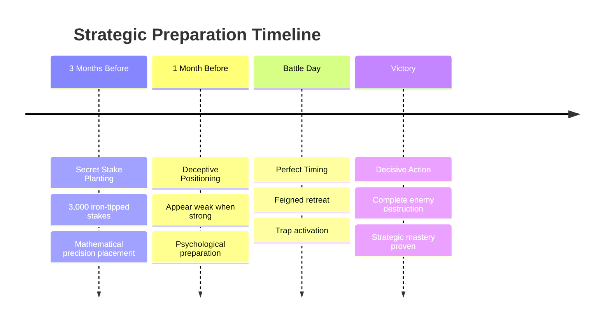
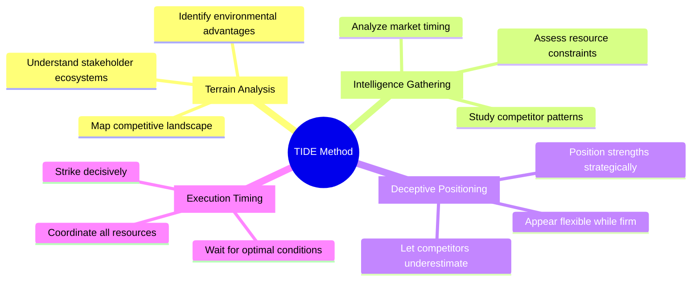
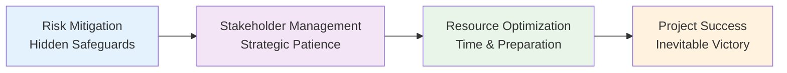
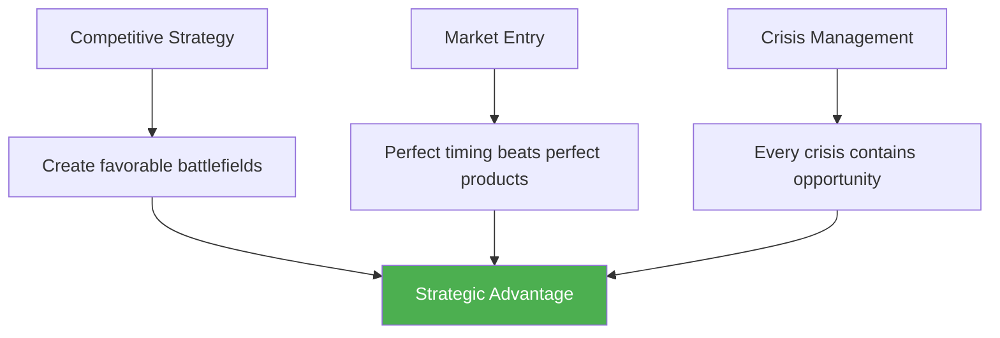

# Battle of Bach Dang: Vietnam's Resounding Victory

## 🎯 The Art of Strategic Mastery That Echoes Through Modern Project Management

*April 9, 1288 - When 3,000 hidden stakes shattered an empire's dreams and birthed timeless lessons in strategic excellence*

---

## 🌊 The Stage is Set: David vs. Goliath on Water

Picture this: The year is 1288. The Mongol Empire, having conquered from Eastern Europe to the Pacific, sets its hungry eyes on the last unconquered jewel of Southeast Asia - Vietnam. 

Their naval armada, a floating fortress of over **400 war vessels**, cuts through the waters of Bach Dang River like a steel tsunami. The commanders Omar and Sogetu, drunk on centuries of unbroken victories, believe this will be just another routine conquest.

But beneath the murky waters of Bach Dang River, something extraordinary awaits - **3,000 iron-tipped wooden stakes**, planted with surgical precision by a military genius who understood that:

> **"The greatest victories are won before the battle begins"**

---

## 🧠 The Mastermind: Tran Hung Dao

**The Sun Tzu of Southeast Asia**

Prince Tran Quoc Tuan, known as Tran Hung Dao, was Vietnam's supreme commander - a man who understood that:

> **"True strength lies not in what you show, but in what you hide"**

While the Mongols boasted of their naval supremacy, Tran Hung Dao was orchestrating what would become one of history's most brilliant strategic deceptions.

### 💡 Modern Strategic Parallel
Like a master project manager who doesn't compete on resources but on innovation, Tran Hung Dao didn't try to build a bigger navy - he built a smarter trap.

---

## 🎮 Interactive Historical Recreation

[Enhanced Interactive Battle Map will be embedded here]

---

## 🏛️ The Four Pillars of Strategic Mastery

### 1. 🗺️ Environmental Intelligence
**"Know Your Battlefield Better Than Your Enemy"**



**Historical Execution:**
- ✅ Mapped every curve, depth, and tidal pattern
- ✅ Identified optimal stake placement
- ✅ Calculated precise timing for trap activation

**Modern Project Application:**
- 📊 **Risk Assessment**: Map every potential project risk
- 🎯 **Resource Optimization**: Understand your environment better than competitors
- 👥 **Stakeholder Analysis**: Know organizational "tides" and timing

---

### 2. 🎭 The Art of Strategic Deception
**"Preparation Over Reaction"**



**Modern Applications:**
- 🛡️ **Contingency Planning**: Build safeguards before crises hit
- 🕵️ **Competitive Intelligence**: Prepare advantages competitors can't see
- ⏰ **Timeline Management**: Patient preparation beats rushed reaction

---

### 3. 🧠 Psychology of Strategic Deception
**"Appearing Weak When Strong"**

```mermaid
flowchart LR
    A[Mongol Confidence] --> B[Vietnamese "Retreat"]
    B --> C[Enemy Pursuit]
    C --> D[Trap Zone Entry]
    D --> E[Stakes Revealed]
    E --> F[Complete Victory]
    
    style A fill:#ff6b6b
    style F fill:#51cf66
```

**The Psychological Game:**
1. **Feigned Retreat** → Vietnamese junks appeared to flee
2. **Overconfidence Trigger** → Mongols pursued eagerly
3. **Tactical Positioning** → Drew enemies into kill zone
4. **Perfect Timing** → Low tide revealed the stakes

**Modern Applications:**
- 🤝 **Negotiation Strategy**: Flexibility can lead to better outcomes
- 🏆 **Competitive Positioning**: Let competitors underestimate you
- 🔄 **Change Management**: Guide resistance into your strong areas

---

### 4. ⏰ Perfect Timing
**"The Convergence of Preparation and Opportunity"**

```mermaid
gantt
    title The Perfect Timing Strategy
    dateFormat X
    axisFormat %H:%M
    
    section Preparation
    Stake Planting    :done, prep, 0, 3h
    Fleet Positioning :done, pos, 3h, 1h
    
    section Deception
    Feigned Battle    :active, battle, 4h, 30m
    Strategic Retreat :retreat, 4h30m, 30m
    
    section Victory
    Tide Recedes      :crit, tide, 5h, 15m
    Stakes Revealed   :crit, stakes, 5h15m, 15m
    Enemy Trapped     :victory, 5h30m, 30m
```

**Critical Success Factors:**
- 🌊 **Tidal Calculation**: Stakes revealed at perfect moment
- ⚓ **Fleet Coordination**: Multi-directional attack
- 💥 **Psychological Impact**: Complete surprise advantage
- 🏆 **Decisive Victory**: Fleet destroyed, commanders captured

---

## 📊 Strategic Framework: The TIDE Method

### 🔄 Modern Decision-Making Framework



---

## 🎯 Modern Applications

### 📋 For Project Managers



### 🏢 For Business Leaders



---

## 🏆 The Eternal Lesson

> **"The best victories are those that appear effortless to observers but required months of invisible preparation by the victor."**

The Battle of Bach Dang teaches us that in any competitive environment - whether ancient warfare or modern business - victory belongs not to the strongest, but to the most strategically prepared.

### Key Takeaways:

1. **🎯 Strategic Thinking** > Raw Strength
2. **⏰ Perfect Timing** > Perfect Resources  
3. **🧠 Environmental Mastery** > Technological Superiority
4. **🎭 Psychological Advantage** > Physical Advantage

---

## 🎮 Experience the Strategy

[Enhanced Interactive Battle Map will be embedded here]

*Click through the battle phases above to experience how strategic thinking, environmental mastery, and perfect timing created one of history's most brilliant victories.*

---

## 💭 Strategic Reflection Questions

**For Your Next Challenge:**

1. 🗺️ **What are the "tides" in your environment that you can leverage?**
2. 🛡️ **What "stakes" can you plant now that will become advantages later?**
3. 🎭 **How can you appear weak in non-critical areas while building strength where it matters?**
4. ⏰ **What would perfect timing look like for your strategy?**
5. 🎯 **Are you prepared to execute with total commitment when the moment comes?**

---

**Ready to apply these ancient strategic principles to your modern challenges?** 

The waters of Bach Dang may be 700 years in the past, but the strategic currents they reveal flow through every boardroom, project plan, and competitive landscape today.

*What hidden stakes are you preparing in your professional waters?*

